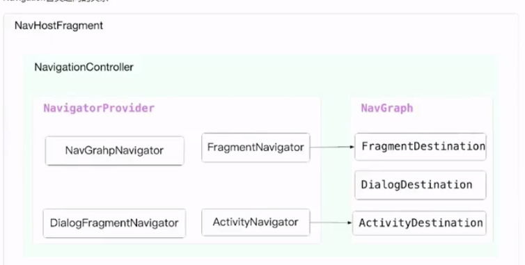

## 阶段一： 构建底部导航栏

### Navigation 工作原理

> NavHostFragment 作为内容的承载容器，在它的 onCreate 中创建了 NavHostController ，NavHostController 将页面切换的能力委托给了NavController ，由 NavController 负责容器中节点的路由工作。NavController 创建了四种 Navigator ，分别是 DialogFragmentNavigator 、FragmentNavigator 、ActivityNavigator 、NavGraphNavigator ，并添加到 NavigatorProvider 。NavigatorProvider 本质是一个 HashMap ，以键值对的形式存储一个个的导航器实例。
>
> DialogFragmentNavigator 、FragmentNavigator 、ActivityNavigator 分别负责 DialogFragment、Fragment 以及 Activity 的路由导航工作。当 mobile_navigation.xml 页面的节点信息被解析完成之后会使用 NavGraphNavigator 去跳转到我们配置的默认启动页。这四个 Navigator 都必须声明 Name注解，例如 ActivityNavigator 声明了 Name 注解是 Activity，NavGraphNavigator 声明了 Name 注解是 navigation ；之所以必须声明 Name 注解是因为 NavigatorProvider 存储这些 Navigator 的时候都是以它们的 Name 作为 key ，实例作为 value 。Name 可以理解为 Navigator 导航器的别名，声明是给哪种类型的页面提供导航服务。
>
> **ActivityNavigator 是如何跳转 Activity ？**
>
> ActivityNavigator 在创建 Destination 的时候会把 Name 注解赋值给 Destination 的 NavigatorName 。ActivityNavigator 通过调用 navigate 来实现 activity的跳转，navigate 中会传入 Destination ，通过收集 Destination 中的 intent 信息最终通过 mContext.startActivity 完成跳转。为什么要在 Destination 中保存对应 Navigator 的 Name 注解？这是因为 NavGraphNavigator 调用 navigate 去配置默认启动页的时候会根据 startDestination 也就是配置了默认启动的节点的 NavigatorName 去从 NavigatorProvider 中拿到对应的 Navigator 去处理对应页面类型的跳转工作。
>
> **DialogFragmentNavigator 是如何跳转 DialogFragment ？**
>
> 调用 navigate 并传入 Destination ，通过 Destination 拿到 class 的全类名，然后反射构造出 dialogFragment 最终调用 show 方法。
>
> FragmentNavigator 是如果跳转 Fragment ？
>
> 调用 navigate 并传入 Destination ，通过 Destination 拿到 class 的全类名，然后反射构造出 Fragment，通过调用 FragmentManager 的 beginTransaction 开启事务，最终调用 replace 将页面显示到容器中。replace 会造成 Fragment 页面的重启，view 的重新创建，数据的重新加载。
>
> **NavGraphNavigator 是如何跳转到默认启动页的 ？**
>
> NavGraphNavigator 的 Destination 是 NavGraph，NavController 在解析 mobile_navigation.xml 配置文件时，会根据标签的名称从 NavigatorProvider  中取出对应的 Navigator 实例并调用 createDestination 生成页面节点，然后把所有页面的节点存入到 NavGraph 的 mNodes 中，并且记录 startDestination 对应的 id。最后根据 id 找到对应的 NavDestination ，通过 NavigatorProvider 中取出相应页面的 Navigator 处理默认启动页的展示。
>
> 

### AS提供的Bottom Navigation 模板代码的弊端

1. 底部导航栏的按钮以及 Navigation 路由节点都必须在 xml 文件中配置，缺乏灵活性。
2. FragmentNavigator 跳转 Fragment 采用的是 replace 方法会造成 Fragment 页面的重启、数据的重新加载

### BottomNavigationView 以及 Navigation 框架改造

**Navigation 框架改造**

> 仿造谷歌的 Navigation 工作原理，自定义 FragementDestination、ActivityDestination 注解以及注解处理器。FragementDestination 用于给 Fragment 使用，ActivityDestination 用于给 Activity 使用。这两个注解分别有三个参数：pageUrl（页面身份标识）、asStarter（是否作为默认启动页）、needLogin（是否需要登录）。我们自定义的注解处理器会去解析类的头部注解信息，每一个类的注解信息会封装成一个 JSONObject 对象，并存入 HashMap 中，以 pageUrl 作为 key 值。然后将这些注解信息输出成一个 json 文件，然后构建生成 Destination 这个JavaBean 对象。拿到所有页面的 Destination 对象之后，add 进 NavGraph 中，然后再将 NavGraph 添加进 NavController 中。至此就实现了无需在 mobile_navigation.xml 中配置路由页面节点信息，而是通过 json 文件去动态下发配置给 NavController 。
>
> 新建 FixFragmentNavigator 继承 FragmentNavigator ，改造 navigate 方法。将 replace 方法改成 hide 和 show ，将当前页面 hide，下一个要显示的页面 show。然后再添加进 NavigatorProvider 中，后续通过 createDestination 生成 Destination 的时候使用 FixFragmentNavigator ，最终就可以实现 Fragment 切换时不会导致 Fragment 页面重启的问题。

**BottomNavigationView 改造**

新建 AppBottomBar 继承 BottomNavigationView 重写构造函数。新建用于构建底部导航栏按钮相关参数的json文件，通过解析这个json文件生成对应的JavaBean。然后将Bean对象中的每一个tab添加进 MenuItem ，itemId 使用的 tab 的 pageurl，tab 的 pagurl 与每个页面的 pageurl 一一对应。最后对 BottomNavigationView 添加点击事件，每次点击都会调用 NavController 的 navigate 方法，传入的 id 就是 MenuItem 的 ItemId，从而实现底部导航栏按钮与页面的一一绑定。